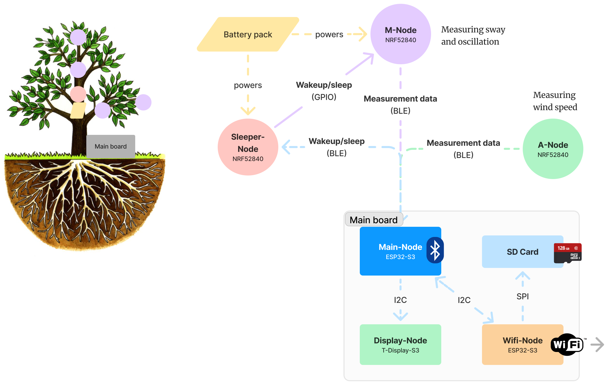

# Measuring tree sway

This repository contains the code for a project that aims to measure the sway of trees using a network of sensors.

There is 6 main components to this project:

## M-Node

The M-Node is placed on the tree trunk and branches to measure the sway of the tree and the oscillations of the branches.

We choosed to use a XIAO BLE Sense (nFR52840) for his very low power consumption, BLE capabilities, tiny form factor and built-in sensors (accelerometer and gyroscope).

The M-Node is powered by a battery pack, and communicate with the Main-Node using BLE.

It can be put to sleep or woken up by the Sleeper-Node when there is no wind to save power.

The M-Node is programmed using the Arduino IDE. The source code can be found in the [nrf-sensor-server](./nrf-sensor-server) folder. The A-Node and M-Node share the same source code. Define `NODE_TYPE` to `M_NODE` to compile the M-Node code.

## A-Node

The A-Node is placed on the ground and is used to measure the wind speed and direction.

We also use a XIAO BLE Sense (nFR52840) for the same reasons as the M-Node.

The A-Node is programmed using the Arduino IDE. The source code can be found in the [nrf-sensor-server](./nrf-sensor-server) folder. The A-Node and M-Node share the same source code. Define `NODE_TYPE` to `A_NODE` to compile the A-Node code.

## Sleeper-Node

The Sleeper-Node is placed on the tree trunk and is used to wake up the M-Node when there is wind.

His role is to convert the sleep and wake up signal sent by the Main-Node through BLE to a digital signal that can be read by the M-Node. We have to use another microcontroller because the XIAO BLE Sense can't wake up from sleep using BLE.

The Sleeper-Node is a simple XIAO BLE, programmed using the Arduino IDE. The source code can be found in the [sleeper](./nrf-sensor-server) folder.

## Main-Node

The Main-Node is placed on the main board, on the ground. It is used to collect the data from the M-Node and A-Node. This is the central node of the network.

We use a esp32-s3 for his BLE and Wifi capabilities, and his low power consumption.

The Main-Node is connected through BLE to the M-Node and A-Node, and send the data to the Display-Node through Wifi. It also send the sleep and wake up signal to the Sleeper-Node.

To be able to monitor and the system, the Main-Node also send his data to the Display-Node through i2c.

The controls buttons placed on the main board are also connected to the Main-Node.

The Main-Node is programmed using ESP-IDF due to the lack of BLE support in the Arduino ESP32 framework. The source code can be found in the [esp32-multi-connect-ble-client](./esp32-multi-connect-ble-client) folder.

## Display-Node

The Display-Node is placed on the main board, on the ground. It is used to display the data collected by the Main-Node.

We use a esp32-s3 for his Wifi capabilities, and his low power consumption.

The Display-Node is connected through i2c to the Main-Node. It is put to sleep and wake-up by the Main-Node to save power.

The Display-Node is programmed using the Arduino Framework through PlatformIO. The source code can be found in the [T-Display-S3](./T-Display-S3) folder.

## Wifi-Node

The Wifi-Node is placed on the main board, on the ground. It is used to send the data collected by the Main-Node to the cloud.

It can also write the data to a SD card.

We use a esp32-s3 for his Wifi capabilities, and his low power consumption.

The Wifi-Node is connected through i2c to the Main-Node.

The Wifi-Node is programmed using ESP-IDF The source code can be found in the [wifi-node](./wifi-node) folder.
