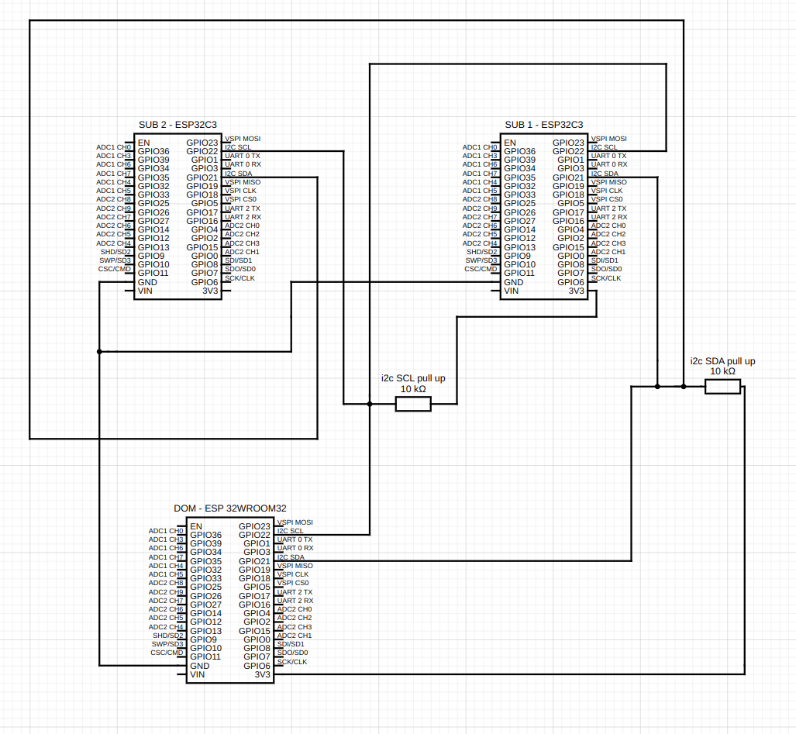

# wifydra 2.0

This is another wifiydra implemenation using ESP IDF from espressif in the hopes that we can make some improvements.

Warning: A lot of this code was writting with help from Claude Code, I did my best to review everything it wrote, but there could be some garbage in here.

## Hardware 
Currently the DOM node (an ESP32 WROOM32) can connect to multiple SUB nodes (seeed studio esp32s3) via i2c. SCL and SDA lines are just tied together, but each line is pulled high by connecting 3.3v to a 10k resistor. Ground is connected and 5v would be connected if we were past testing.

## Credits

- [**franckg28**](https://github.com/FranckG28/measuring-tree-sway): This was the foundation of my i2c communication on ESP IDF, I could not have gotten this working without that foundation.